#Labs 1 and 2: Command Line

### hostname
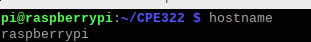

### env
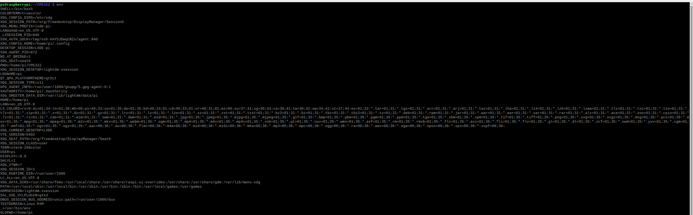

### ps
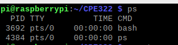

### pwd
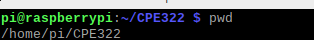

### git clone
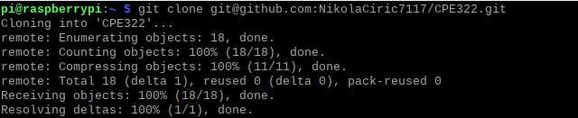

### cd iot, ls and cd
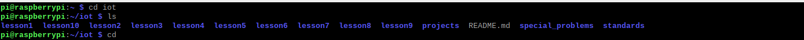

### df
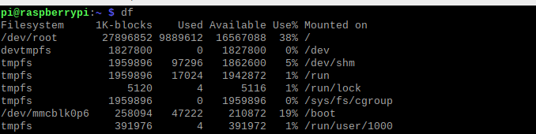

### mkdir demo and cd demo

### nano file
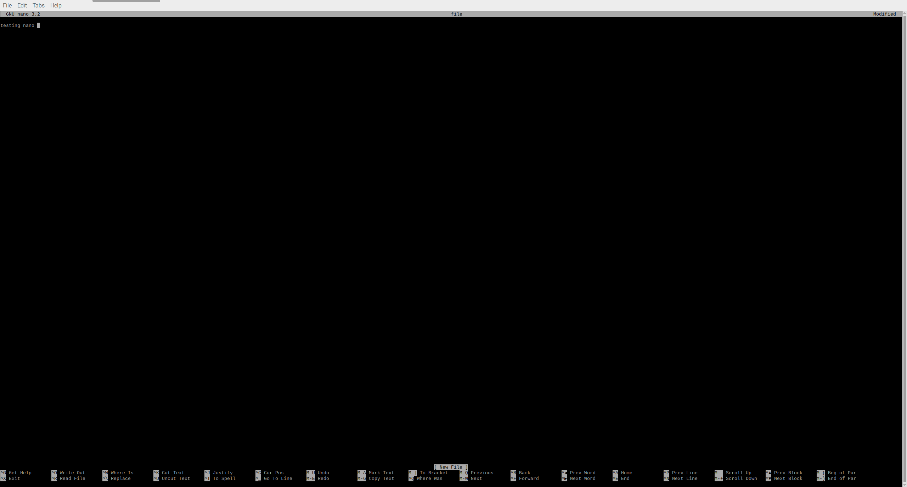

### cat file
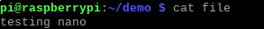

### cp, mv and rm
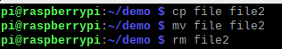

### clear

### man uname
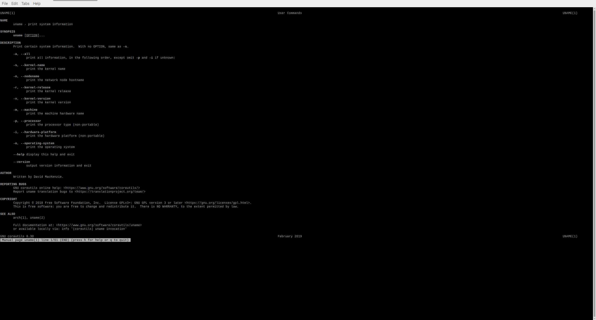

### uname -a
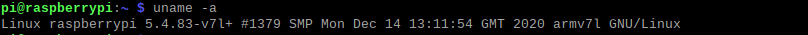

### ifconfig
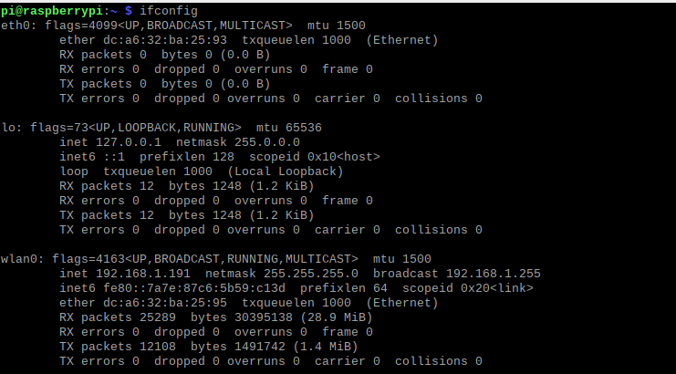

### ping localhost
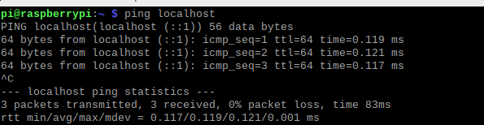

### htop
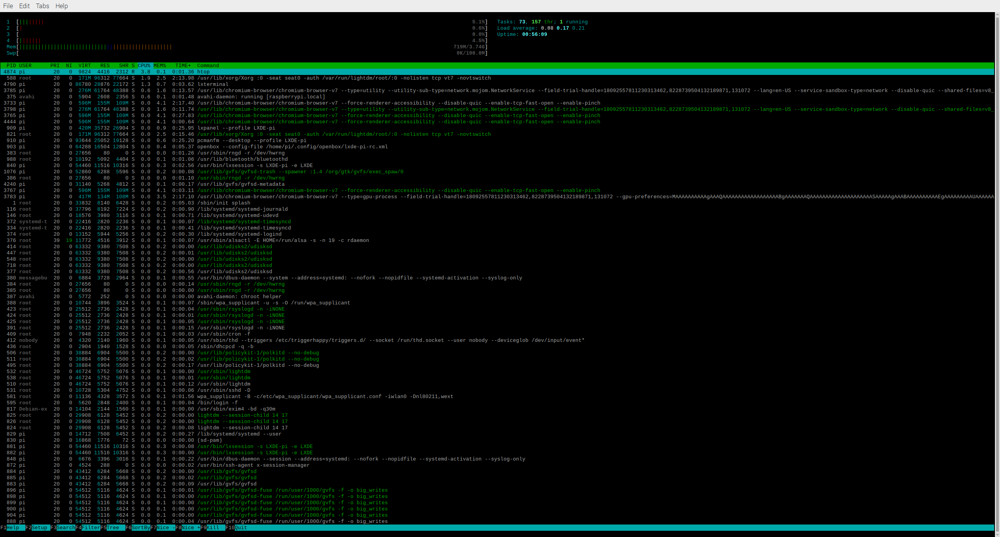

### ping ssh
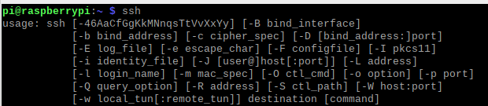

### ping netstat
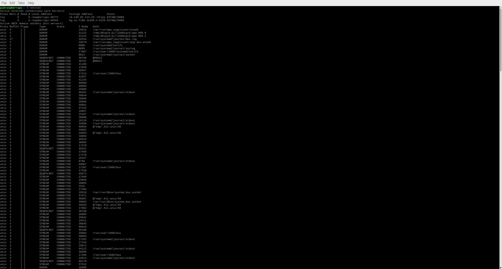

