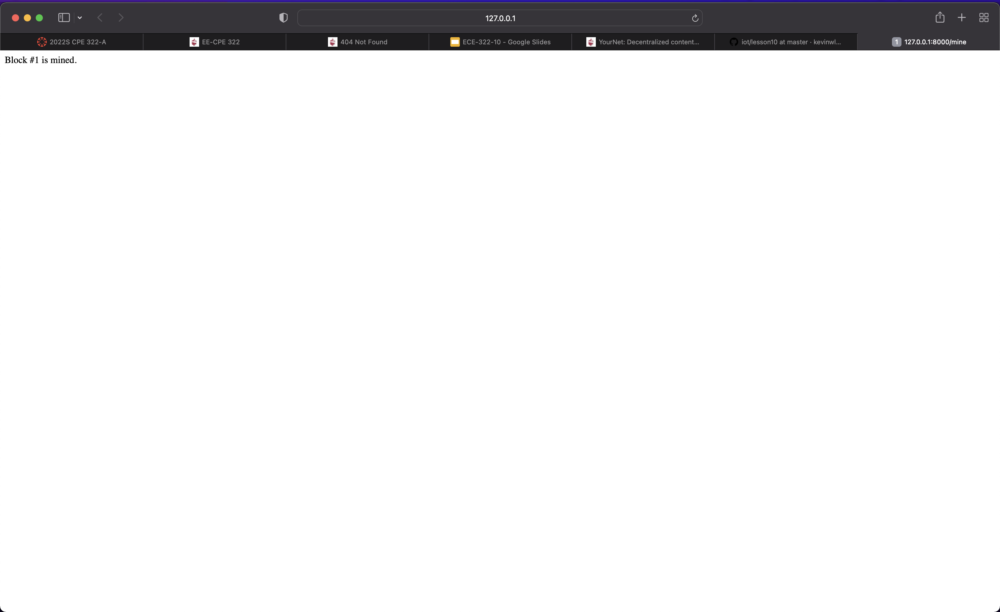

# Lab 10: Blockchain

### cd ~/iot/lesson10,  cat hash_value.py, python3 hash_value.py, python3 hash_value.py

### cat snakecoin.py

### python3 snakecoin.py

### cat snakecoin-server-full-code.py

### python3 snakecoin-server-full-code.py

### snakecoin server display

###  Create a transaction and mine a new block at http://127.0.0.1:5000/mine

###  Create a  second transaction and mine a new block at http://127.0.0.1:5000/mine

### git clone https://github.com/satwikkansal/python_blockchain_app.git, cd ~/python_blockchain_app, 

### nano node_server.py

### python3 node_server.py

### open a browser and went to YourNet running at http://127.0.0.1:5000/

### Display that shows a block is mined at http://127.0.0.1:8000/mine

### Resync to view Block #1

### sudo pip3 install pyota[ccurl]

###  python3 iri_node_info.py
