# Lab 3: python

### julian.py
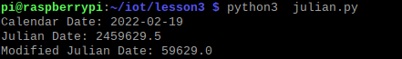

### date_example.py
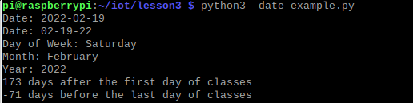

### datetime_example.py
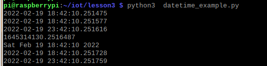

### time_example.py
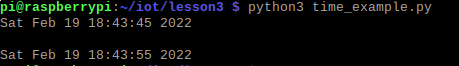

### sun.py
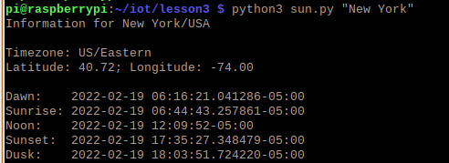

### moon.py
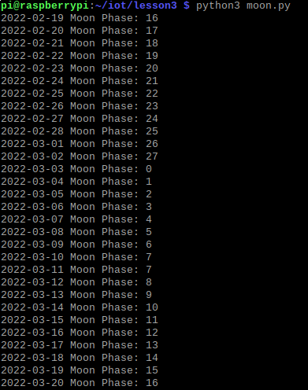

### coordinates.py
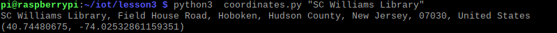

### address.py
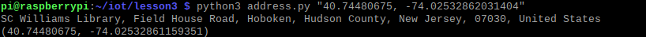

### cpu.py
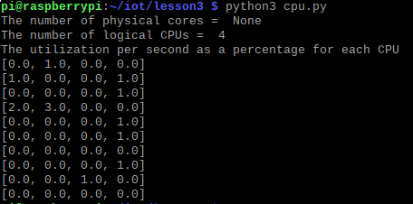

### battery.py
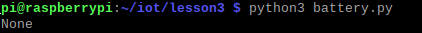

### documentstats.py
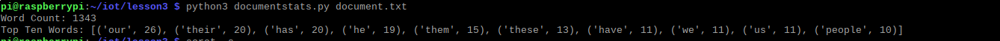

