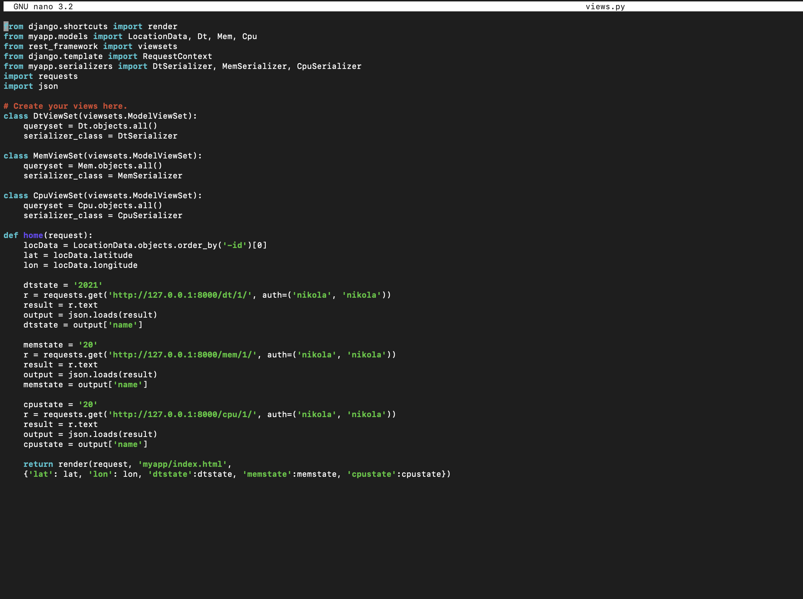

# Lab 4: Django and Flask

## MyCpu

### start mycpu project

### start Django app

### copy files

### change password in views.py

### copy static files

### edit idex.html

### copy more static files

### edit controller.py

### admin view

### post to dt list

###  post to cpu list

### post to mem list

### home page view 

## Flask
### run Flask server

### Flask server display

