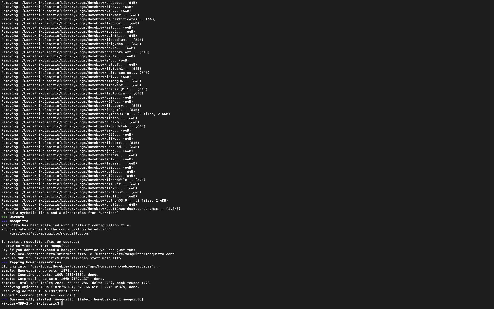
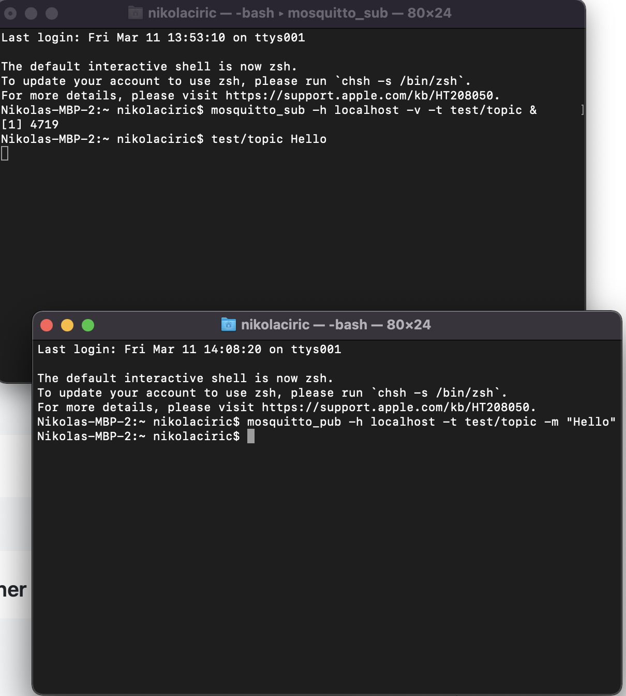
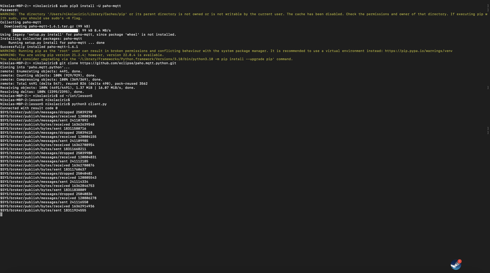
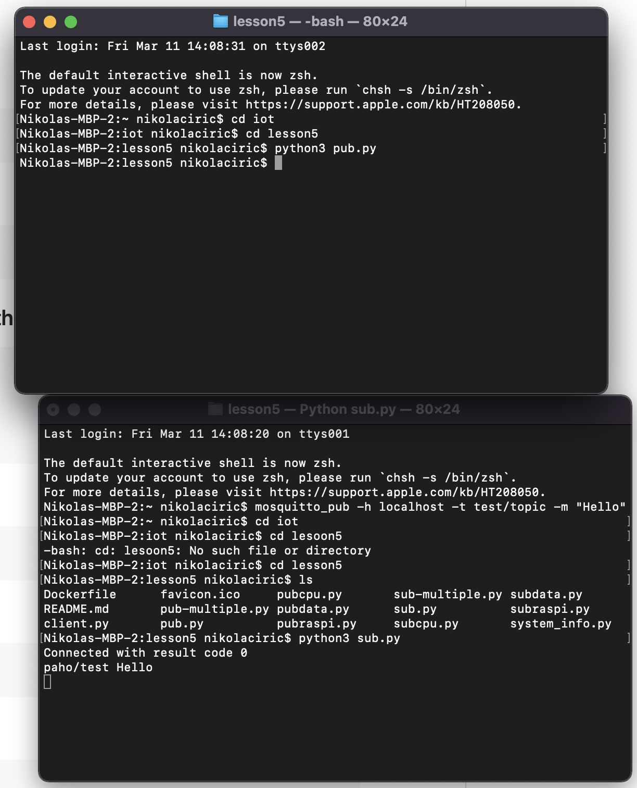
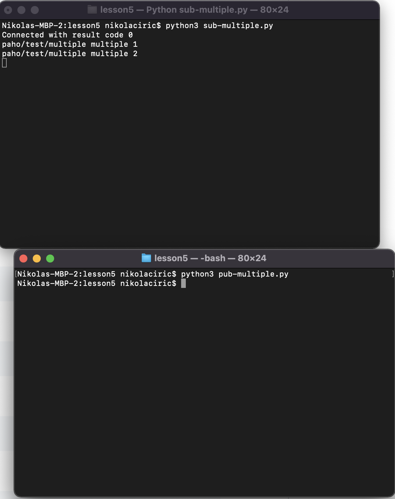
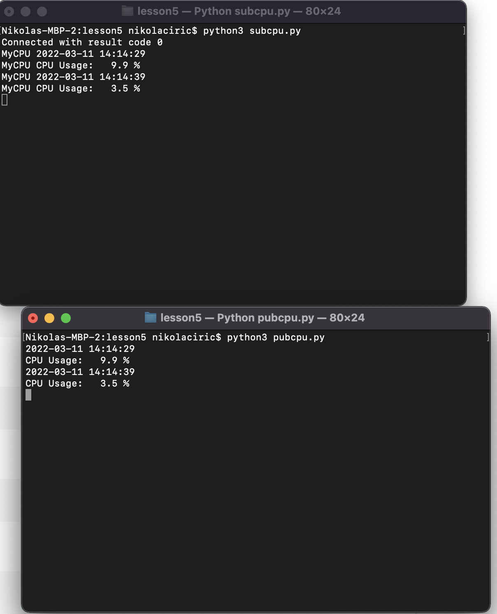

# Lab 5: Paho

### Install and start Mosquitto

### Install and run Mosquitto to subscribe on one terminal and publish on another

### Intall Paho and run code to subscribe on one terminal and publish on another

### Run sub.py and pub.py

### Run sub-multiple.py  and pup-multiple.py

### Run subcpu.py  and pupcpu.py

