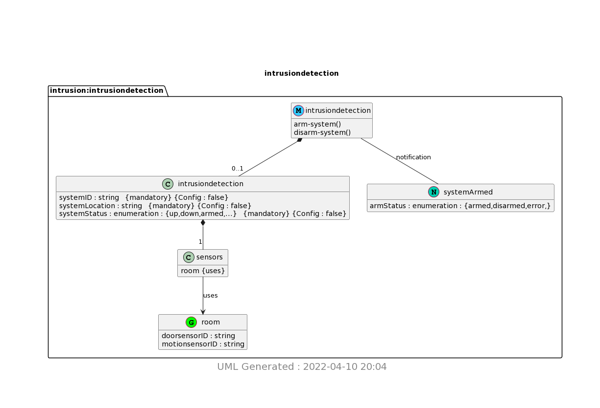
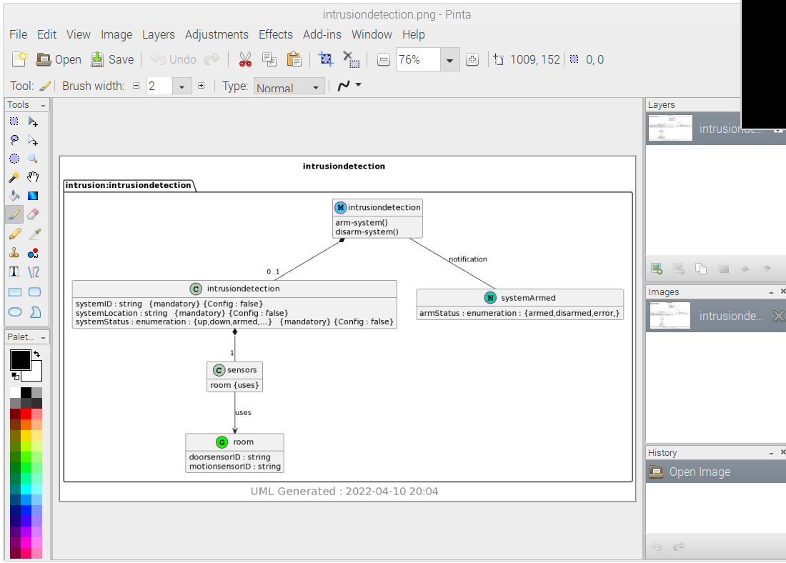

# Lab 9: YANG and Qiskit

### cat intrusiondetection.yang

### cat intrusiondetection.yin

### cat intrusiondetection.uml

### sudo pip3 install -U plantuml

### python3 -m plantuml intrusiondetection.uml

### pinta intrusiondetection.png

### gimp -a intrusiondetection.png

